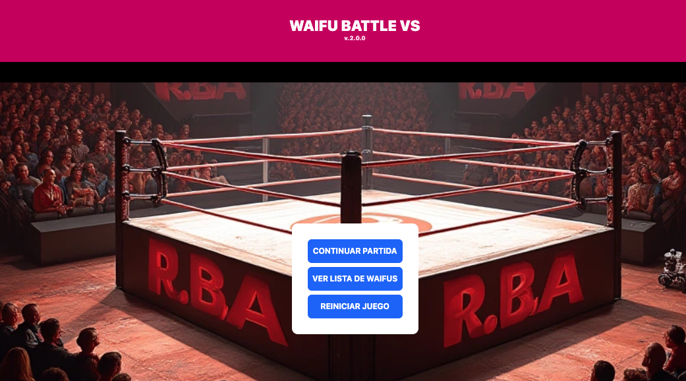
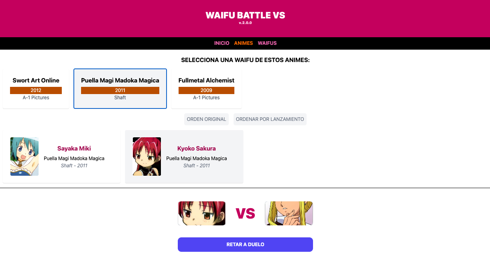
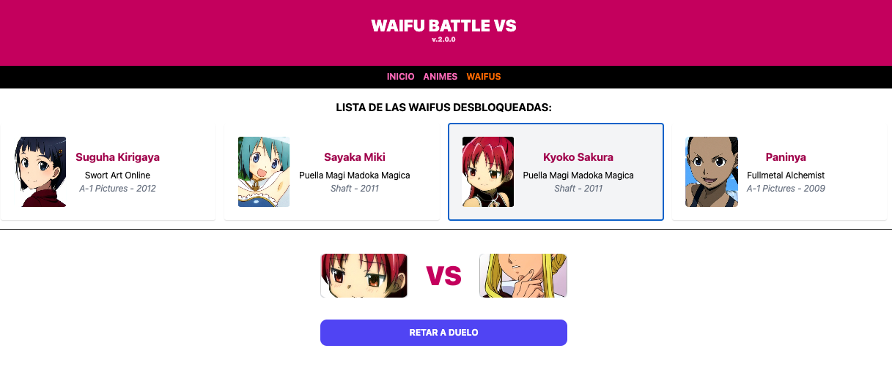
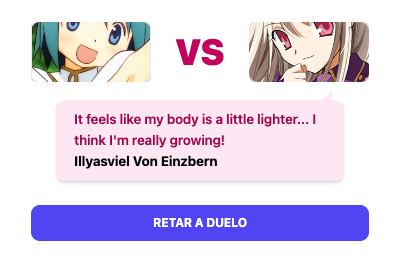
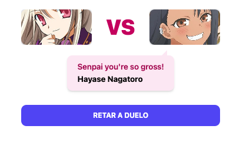

# A web-based waifu card game
A web-based video game where you can choose and compete against waifu cards from different anime, unlocking them after beating them in a rock-paper-scissors-style game, but with numbers. The site features a welcome cover and two sections for choosing your character (by anime or by waifu list).

All character images are loaded from the [myanimelist.net](https://myanimelist.net/) website URL








## Technologies
React + Typescript + TailwindCSS + Zustand + Axios + Zod + React Router and different libraries that are listed in the development commits
## Deploy on Netlify
Website hosted on netlify.app server
[waifu-battle-vs](https://waifu-battle-vs.netlify.app/)

## Developer Notes
### Managed by Zustand
#### src/store/index.ts
```
import { create } from "zustand";
import { WaifubotDB, type WaifubotDBType } from '../data/db';
import { toast } from "react-toastify";
import { devtools } from "zustand/middleware";

 export type WaifuState = {
    waifuListFull: WaifubotDBType[]
    setWaifuList: ( id : number ) => void
    resetWaifuList: () => void
    anime: string
    setAnime: ( anime : string ) => void
    currentWaifu: WaifubotDBType[]
    resetCurrentWaifu: () => void
    modal: boolean
    setModal: ( estado : boolean ) => void
    level: number,
    setLevel: ( level : number ) => void
    allWaifus: boolean
    setAllWaifus: ( allWaifus : boolean ) => void
    challenger: string
    setChallenger: ( challenger : string ) => void
    rival: WaifubotDBType
    lastWaifus: number
    setRival: () => void
    selectWaifu: ( idWaifu : number ) => void
    availableAnimes: WaifubotDBType[]
    ordenaAnime: () => void
    animesperYear: () => void
    modalFinal: boolean
    setModalFinal: ( modalFinal : boolean ) => void
}

export const useWaifuStore = create<WaifuState>()(
    devtools( ( set , get ) => ({
    waifuListFull: (() => {
        const data = localStorage.getItem('waifuListStorage')
        return data ? JSON.parse( data ) : WaifubotDB
    })(),
    setWaifuList: ( id ) => {
        set( ( state ) => ({
            waifuListFull: state.waifuListFull.map( waifu => waifu.id === id ? { ...waifu , seleccionable: true } : waifu )
        })) 
        localStorage.setItem( 'waifuListStorage' , JSON.stringify( get().waifuListFull ) )
    },
    resetWaifuList: () => {
        get().waifuListFull = WaifubotDB
    },
    anime: WaifubotDB[0].anime,
    setAnime: ( anime ) => {
        set( { anime } )
    },
    currentWaifu: [],
    resetCurrentWaifu: () => {
        set( { currentWaifu : [] } )
    },
    modal: false,
    setModal: ( modal ) => {
        set( { modal } )
        if( modal ){
            toast.warning( 'Elije una de las casillas de tu Waifu!' ,{
                position: 'top-left',
                theme: "dark",
                autoClose: 3000,
                hideProgressBar: true
            })
        }
    },
    level: 680, //680
    setLevel: ( level ) => {
        set( { level } )
    },
    allWaifus: false,
    setAllWaifus: ( allWaifus ) => {
        set( { allWaifus } )
    },
    challenger: 'x',
    setChallenger: ( challenger ) => {
        set( { challenger } )
    },
    rival:null,
    lastWaifus: 100,
    setRival: () => {
        
        const hiddenWaifus = get().waifuListFull.filter( waifu => !waifu.seleccionable )
        set( { lastWaifus : hiddenWaifus.length } )
        //console.log( {hiddenWaifus} )
        const sortbyLevel = hiddenWaifus.sort( (a,b) => a.level - b.level )
        set({ rival :  sortbyLevel[0] }) 
        
    },
    selectWaifu: ( idWaifu ) => {
        const currentWaifu = get().waifuListFull.map( waifu => idWaifu === waifu.id ? waifu : null ).filter( waifu => waifu !== null )
        set( { currentWaifu } )
        get().setRival()
        toast.success( `Has seleccionado a ${ currentWaifu[0].name }!` , {
            position: 'top-center',
            theme: "dark",
            autoClose: 2000,
            hideProgressBar: true
        })
    },
    availableAnimes: [],
    ordenaAnime: () => {
        const availableAnimes = get().waifuListFull
            .filter( w => w.seleccionable )
            .filter( ( waifu , index , self ) => self.findIndex( w => w.anime === waifu.anime ) === index )

        set( { availableAnimes } )
    },
    animesperYear: () => {
        const availableAnimes = get().availableAnimes.sort( ( a , b ) => Number( a.year ) - Number( b.year ) ) 
        set( { availableAnimes } )
    },
    modalFinal: false,
    setModalFinal: ( modalFinal ) => {
        set( { modalFinal } )
    }
}) ))
```
### Managed by React Router
#### AppRouter.tsx
```
import { BrowserRouter, Route, Routes } from 'react-router-dom'
import Layout from './src/layouts/Layout';
import { lazy, Suspense } from 'react';

const Portada = lazy( () => import('./src/views/Portada') )
const Battle = lazy( () => import('./src/views/Battle') )
const Waifus = lazy( () => import('./src/views/Waifus') )

export default function AppRouter() {

  return (
    <BrowserRouter>
        <Routes>
            <Route element={ <Layout /> }>
                
                <Route path='/' element={ 
                  <Suspense fallback={
                    <div className="text-center text-pink-600 text-xl font-bold py-10">Cargando...</div>
                  } > <Portada /> </Suspense>
                 } index />
                
                <Route path='/battle' element={ 
                  <Suspense fallback={
                    <div className="text-center text-pink-600 text-xl font-bold py-10">Cargando...</div>
                  }> <Battle /> </Suspense>   
                 } />

                <Route path='/waifus' element={ 
                  <Suspense fallback={
                    <div className="text-center text-pink-600 text-xl font-bold py-10">Cargando...</div>
                  } > <Waifus /> </Suspense>
                 } />

            </Route>
        </Routes>
    </BrowserRouter>
  )
}
```
### Managed by Anime Chan API (Axios and Zod)
#### services/WaifuQuoteService.ts
```
import axios from "axios"
import { API_Schema } from "../schemas/waifuAPISchema";

export async function waifuQuote( character : string ){

    const url = `https://api.animechan.io/v1/quotes/random?character=${encodeURIComponent(character)}`;
    try{
        const { data } = await axios( url ,  { headers: {'x-api-key': import.meta.env.VITE_OPENROUTER_KEY}})
        const result = API_Schema.safeParse( data )
        return result.data?.status ? result.data.data.content +' @ '+ result.data.data.character.name : '* He prepares to attack without showing up *'
        
   } catch( error ) {
        return '>> She just looks at her without saying anything. <<'
    }
}
```
